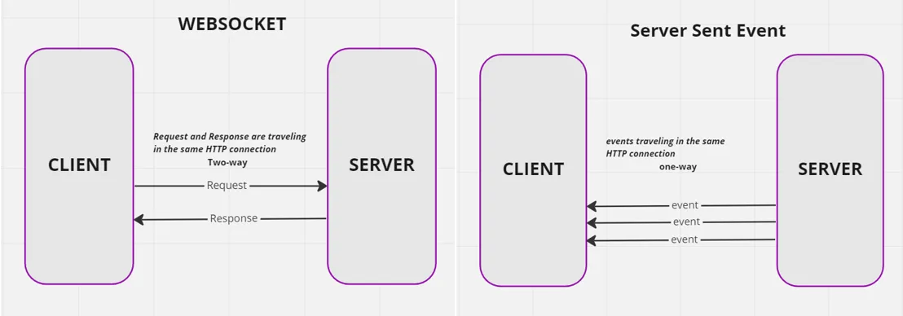

# 🌐 API

- Student: Tristan Brattinga (500881296)
- Duur: 31 maart 2025 - 25 april 2025
- Docent(en): Cyd Stumpel & Declan Rek

## 📝 Opdrachtomschrijving

Voor het vak API ben ik aan de slag gegaan met het creëren van een server-side gegenereerde web app.

De volgende randvoorwaarden zijn van toepassing voor deze opdracht:

- Minimaal een overzichts- en detailpagina
- Gebouwd in TinyHTTP + Liquid
- Minimaal een content API
- Minimaal twee Web API's

## 💡 Week 1: Kickoff & Concept

Voor de aanvang van week 1 van het vak API ben ik ernstig ziek geworden, waardoor ik de hele week niet bij de lessen op
school aanwezig kon zijn. Ik heb mij in de eerste week ingelezen in de opdracht en gekeken naar wat de vereisten zijn
voor het succesvol voltooien van dit vak.

Ik moet dit vak inhalen van vorig jaar, omdat ik het toen niet heb gehaald. Vorig jaar heb ik ervoor gekozen om een 
Whatsapp-replica te gaan bouwen. Toen ter tijd vond ik dit een geweldig concept en leek het mij ook heel tof om dit
leren na te bouwen. Ik heb er toen voor gekozen om
met [WebSockets](https://developer.mozilla.org/en-US/docs/Web/API/WebSockets_API) te werken. Nu wilde ik dit eigenlijk
weer proberen, omdat ik het nooit heb afgemaakt. Ik ben ziek in mijn bed opnieuw begonnen met het opzetten van een 
chat-app die gebruikt maakt van WebSockets. Hier heb ik eigenlijk de hele week een beetje mee gespeeld. Ook had ik nog 
nooit met [TinyHTTP](https://tinyhttp.v1rtl.site/) en [Liquid](https://liquidjs.com/) gewerkt, dus deze week thuis in 
bed kon ik mij hier goed in gaan verdiepen.

### Mijn Idee

Dit jaar wilde ik niet precies hetzelfde concept doorvoeren. Het leek mij een heel vet idee om een soort quiz te 
bouwen, waarbij er verschillende kamers zijn met meerdere gebruikers die punten kunnen scoren door hun antwoorden te 
typen en te versturen naar de server. Zo zijn er een x aantal vragen die de gebruikers kunnen beantwoorden en zal er 
ook een winnaar worden bekroond in het leaderboard. De flow zal zich ongeveer zo afspelen:

```
Overzichtspagina met kamer lijst -> Kamer gejoined nu in de lobby wachtend op spelers -> Spel bezig, verschillende 
vragen -> Spel klaar, leaderboard pagina met winnaar
```

## 📈 Week 2: First Concept

In week 2 was ik gelukkig weer in staat om bij de lessen aanwezig te zijn. Tijdens de les sprak ik mijn docente Cyd 
over mijn idee en ze had een aantal goede punten van feedback en inzichten voor mij. Zij raadde mij vooral aan om geen 
WebSockets te gebruiken, maar met Server Sent Events (SSE) te werken. WebSockets kunnen heel ingewikkeld zijn en SSE is 
makkelijker te implementeren. Het leek mij een goed idee om dit advies aan te nemen aangezien ik al een week van 
het vak heb gemist. Ik legde haar uit wat ik voor ogen zag en dit zou een soort [Kahoot](https://kahoot.it/) webapp 
worden, waarbij er vragen worden gestuurd naar verschillende clients en deze kunnen antwoorden om zo punten te 
scoren. Bij Kahoot is het zo dat er één iemand (admin) is die een kamer creëert, waar andere gebruikers via een 
kamercode zich bij aan kunnen sluiten. 

### WebSockets v.s SSE

Ik had geen idee wat SSE was, hoe het precies werkt en hoe het verschilt van. WebSockets. Voordat ik hiermee aan 
de slag kon moest ik hier eerst onderzoek naar doen. Bij WebSockets kunnen zowel de client als de server request en 
respones elkaar kunnen sturen. Zo kan er real-time communicatie plaatsvinden tussen de client en server. Bij SSE 
kunnen daarentegen alleen real-time "events" van de server naar de client worden gestuurd. Hier is dus geen 
wederzijdse real-time communicatie mogelijk, maar alleen eenzijdig. Dit is dus perfect voor wanneer er real-time 
updates moeten worden gestuurd vanaf de server naar de client in het geval van een live-score website voor 
sportuitslagen, maar ook voor mijn idee waarbij er vragen worden gestuurd naar de client en deze hierop moet antwoorden.


Bron: https://medium.com/@ecemertrk/websocket-vs-sse-24e634930472

### Voortgangsgesprek Cyd

Tijdens mijn eerste voortgangsgesprek met Cyd heb ik mijn prototype laten zien. Ik vertelde haar dat ik best wel zat te 
worstelen met mijn concept en hoe dit er precies uit zou moeten gaan zien. Ook had ik geen idee welke content API ik 
zou moeten gebruiken binnen de context van mijn concept. Cyd kwam met de [Numbers API](http://numbersapi.com/#42).

Zij gaf mij de tip om de flow van mijn web app uit te tekenen

Verder was ze te spreken over mijn eerste styling en had hier en daar wat kleine verbeterpuntjes visueel gezien. Sommige hover-animaties zijn onnodig
en zorg dat de controls groot genoeg zijn voor de gebruiker.

### 🧠 Conclusie

Het is belangrijk dat ik de flow van mijn web app op papier zet zodat ik voor mijzelf visueel een richtlijn kan 
creëren waar ik mij aan vast kan houden tijdens het ontwikkelen. 

## 🔄 Week 3: Switch-It-Up!

In de derde week zat ik helemaal vast met mijn oude concept en was ik niet tevreden over de content API waar ik mee 
aan de slag zou gaan. Het voelde niet goed dus heb ik besloten om mijn concept helemaal om te gooien. Ik hou mijzelf 
veel bezig met crypto dus het leek mij een leuk en toepasselijk idee, om een crypto dashboard te bouwen waarbij je 
real-time prijs updates zou krijgen, waar je favoriete coins kan toevoegen en met verschillende valuta's kan werken. 

Op deze manier kon ik heel makkelijk een goede content API aan mijn idee koppelen. Ik heb wat onderzoek gedaan naar 
de volgende API's:

1. [CoinMarketCap](https://coinmarketcap.com/api/pricing/), dit is de nummer 1 crypto tracking website alleen bij het free-plan zit er geen historische data 
   van de coins bij en zou ik wel graag willen.
2. [CoinGecko](https://docs.coingecko.com/v3.0.1/reference/introduction), dit is een heel erg uitgebreide API met heel veel data beschikbaar via het free-plan. Historische data 
   is beschikbaar en er zijn heel veel verschillende endpoints om data mee op te vragen.
3. [Bitvavo](https://docs.bitvavo.com/docs/rest-api/rest-api/), de REST API van bitvavo is meer bedoeld voor persoonlijk gebruik waarbij je je eigen account kan managen,
   coins kopen en verkopen. Dit is niet echt van toepassing op mijn project.

Ik heb uiteindelijk voor de CoinGecko API gekozen! De documentatie website en alle beschikbare data en informatie gaf 
mij een hele goede indruk bij dit platform. Ik kon gemakkelijk een API key aanmaken en ik heb 10.000 maandelijkse 
API calls inbegrepen bij mijn free-plan.

Ik heb een api.js file gecreëerd waarin ik een aantal utility functions heb geschreven voor het aanroepen van 
verschillende endpoints. Hieronder is de eerste functie te zien om de gehele lijst met coins op te halen:

```javascript
export const fetchCoinList = async () => {
	try {
		const response = await fetch(`${process.env.COINGECKO_API_BASE_URL}/coins/list`, {
			method:  'GET',
			headers: {
				accept: 'application/json',
				'x-cg-demo-api-key': process.env.COINGECKO_API_KEY
			}
		})

		if (!response.ok) {
			throw new Error('Failed to fetch coin list')
		}

		return await response.json()

	} catch (error) {
		console.error('Error fetching coin list:', error)
		throw error
	}
}
```

Deze roep ik in mijn server.js file aan op de volgende manier:

```javascript
const coinList = await fetchCoinList()
```

### Voortgangsgesprek Declan

Mijn voortgangsgesprek met Declan verliep een beetje apart, omdat ik hem nog niet eerder over mijn code had kunnen
spreken. Dit kwam mede door mijn afwezigheid de eerste week en omdat mijn "eerste" feedbackgesprek met Cyd was en
niet met hem. Het enige wat hij dus echt kon doen was uitlezen wat Cyd had geschreven over mijn idee en voortgang.
Hierin stond dat ik een leuk en origineel idee had, mede hierom vond Declan het jammer dat ik was geswitcht. Vooral
omdat wat ik nu had redelijk "saai" zou zijn. Het is dus wel heel belangrijk om mijn prototype goed aan te kleden.

### 🧠 Conclusie

Ik moet ervoor zorgen dat mijn crypto dashboard aangekleed genoeg wordt, om ervoor te zorgen dat het niet te "saai" 
en "simpel" wordt. Het lijkt mij daarom een vet idee om charts met historische data toe te voegen zodat je kan zien 
hoe de coins het over tijd doen.

## 🚀 Week 4: Wrap-up

In week 4 ben ik vooral bezig geweest met styling en het werken krijgen van de SSE. Ik heb mijn styling gebaseerd 
op andere crypto websites zoals die van CoinGecko en CoinMarketCap. 


### Web API's

Ik heb uiteindelijk drie verschillende web api's geïntegreerd in mijn project. Dit zijn de volgende:

1. Server-Sent Events
2. Notification API
3. Share API

### Hosting

Ik wilde mijn Crypto Dashboard graag live zetten. Mijn server moet natuurlijk ergens worden gehost dus dit kan niet 
op platformen als Vercel of Github Pages. Ik heb voorheen wel met [Render](https://render.com/) gewerkt, maar dit is 
heel langzaam en werkte nooit echt naar behoren voor mij. Tijdens mijn korte stage heb ik wat met 
[Railway](https://railway.com/) gewerkt en dit vond ik een heel fijn platform om te gebruiken dus dit ben ik gaan 
uitproberen. Ik kon heel makkelijk een account aanmaken en het is pay-per-use. Ik krijg $5.00 voor mijn trial en er 
wordt gezegd dat bij een low-level server (wat in mijn geval ook zo is), je er een maand mee door kan.  


Ik vind het een heel overzichtelijk en gebruiksvriendelijk platform, dus ik zou dit product zeker aanraden! Ik kon 
heel gemakkelijk env's toevoegen, een eigen domeinnaam instellen en re-deployen wanneer nodig.

### 🧠 Conclusie

Ik ben heel blij met mijn gemaakte keuzes! Ik ben tevreden met de keuze voor het veranderen van mijn opdracht en ik 
vond de API van CoinGecko heel fijn werken en heel duidelijk. Ik ben zeer te spreken over mijn uiteindelijke 
dashboard en ik zou hier graag nog verder aan willen gaan werken om het nog verder uit te breiden en volledig 
werkend te maken.

### Verdere Ontwikkelingen

Als ik meer tijd zou hebben om verder te werken aan dit project, of überhaupt 4 volledige weken aan dit vak had 
kunnen besteden zou ik de volgende functionaliteiten implementeren en/of verder uitwerken:

1. Currency converter
2. Meerdere valuta's toevoegen
3. Valuta selecteren gebaseerd op locale
4. Favorites werkend maken vanuit de detailpage
5. Database toevoegen
6. User authentication toevoegen

## Herkansing

Punten van feedback voor de herkansing en dingen waar ik aan moet werken zijn:
- svg files gwn .svg proberen anders .liquid (DONE ✅)
- Vooral dingen afmaken niet nieuwe toevoegen (DONE ✅)
    - lijstje maken!
- Util Functie maken voor cookies (DONE ✅)
- console.logs eruit halen (DONE ✅)

## 📚 Bronnen

- https://docs.coingecko.com/v3.0.1/reference/introduction